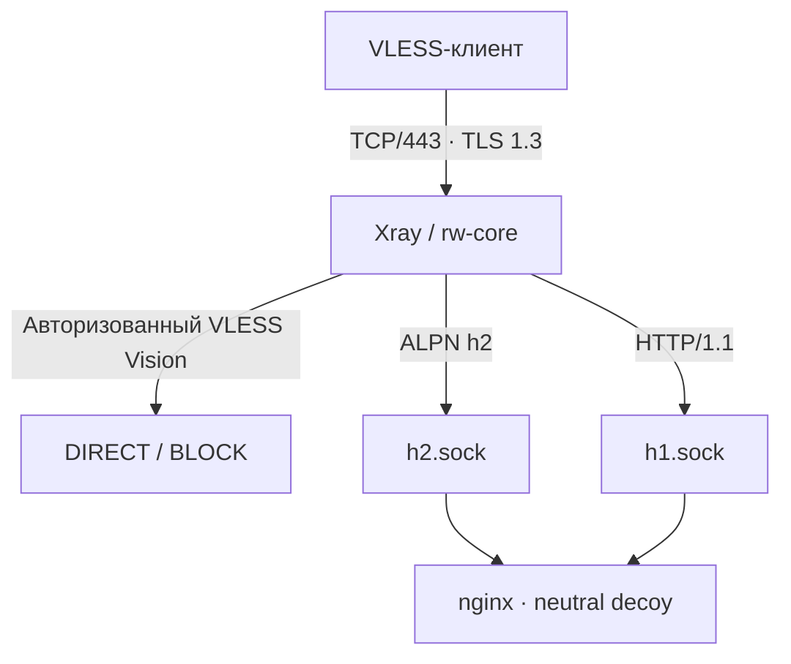

<div align="center">


# ЧебурNET Vision Installer

### VLESS TLS Vision + Unix-Socket Decoy для Remnawave


[](https://github.com/leonidkopysov/CheburNET-Vision-Installer/actions/workflows/validate.yml)
[](LICENSE)
[](#-схема-работы)
[](#-что-потребуется)

**RemnaNode · Xray · TLS 1.3 · XTLS Vision · nginx · Unix sockets · Let's Encrypt**

</div>

## Что устанавливается

- Remnawave Node в Docker с образом, закреплённым по digest;
- VLESS TCP/RAW с TLS 1.3 и `xtls-rprx-vision`;
- настоящий сертификат Let's Encrypt с автоматическим продлением;
- нейтральный локальный сайт-заглушка без упоминания VPN-бренда;
- nginx на хосте, принимающий fallback только через `h1.sock` и `h2.sock`;
- адаптивный тюнинг ЧебурNET, ZRAM, BBR, UFW и Fail2ban;
- ограничение API ноды IP-адресами панели;
- защита Docker-контейнера и systemd sandbox для nginx;
- TrafficGuard по выбору пользователя;
- готовый JSON-профиль ноды и точные параметры Host для панели.

## Схема работы



Внешний TCP/443 принадлежит Xray. nginx не слушает TCP-порты. Порты `8080`, `8081`, `18080` и `18081` не используются. TCP/80 открывается UFW только на время HTTP-01 проверки Certbot.

## Что потребуется

- отдельный чистый сервер Ubuntu 22.04/24.04 или Debian 12/13;
- права `root`, systemd, прямой публичный IPv4 и свободные порты;
- домен с A-записью непосредственно на IP сервера, без CDN-проксирования;
- Remnawave Panel 3.3.0+;
- созданная в панели нода с API-портом `2222` и её полный `SECRET_KEY`;
- IP, с которого панель подключается к API ноды;
- email для Let's Encrypt;
- `python3` и `openssl` до начала интерактивного сбора данных.

## Установка

Запустите от `root`:

```bash
bash <(curl -fsSL https://raw.githubusercontent.com/leonidkopysov/CheburNET-Vision-Installer/main/cheburnet-vision-install.sh)
```

Для запуска с предварительной проверкой SHA-256:

```bash
curl -fsSLO https://raw.githubusercontent.com/leonidkopysov/CheburNET-Vision-Installer/main/cheburnet-vision-install.sh
curl -fsSLO https://raw.githubusercontent.com/leonidkopysov/CheburNET-Vision-Installer/main/SHA256SUMS
sha256sum -c SHA256SUMS && bash ./cheburnet-vision-install.sh
```

Сначала скрипт показывает подробное описание и спрашивает `Установить скрипт? Д — да / Н — нет`. После подтверждения он собирает все данные, проверяет секретный ключ и показывает итоговые параметры. Изменение системы начинается после второго подтверждения.

> [!CAUTION]
> Установщик предназначен для отдельного свободного сервера. Он останавливается при обнаружении существующего nginx, другой ноды, занятых портов или каталога `/opt/remnanode` и не выполняет автоматическую миграцию чужой установки.

## Профиль ноды

После установки выводится JSON-профиль. Он также сохраняется здесь:

```text
/opt/remnanode/vision-config-profile.json
```

В Remnawave откройте раздел профилей конфигурации, создайте новый профиль и вставьте JSON целиком. Затем назначьте этот профиль нужной ноде. Основной inbound называется:

```text
Vision-TLS
```

Ключевые параметры профиля:

| Параметр | Значение | Назначение |
|---|---|---|
| Protocol | `vless` | протокол подключения пользователей |
| Port | `443` | внешний TLS endpoint |
| Security | `tls` | завершение TLS выполняет Xray |
| TLS minVersion | `1.3` | TLS 1.2 отклоняется |
| Flow | `xtls-rprx-vision` | режим Vision по умолчанию для клиентов панели |
| ALPN | `h2`, `http/1.1` | выбор Unix fallback для обычного HTTPS |
| h2 fallback | `/run/xray-fallback/h2.sock` | HTTP/2 сайт-заглушка |
| h1 fallback | `/run/xray-fallback/h1.sock` | HTTP/1.1 сайт-заглушка |
| `rejectUnknownSni` | `true` | неизвестный SNI не принимается |
| DNS | AdGuard DoH → Comss DoH | шифрованное разрешение имён через IPv4 |
| `clients` | `[]` | пользователей динамически добавляет Remnawave |

Не добавляйте пользователей вручную в `clients`: панель формирует рабочую конфигурацию ноды сама. Название inbound `Vision-TLS` должно совпадать с inbound, выбранным для Host.

## Настройки Host в Remnawave

После назначения профиля ноде создайте или измените Host. Скрипт выводит готовую памятку и сохраняет её в:

```text
/opt/remnanode/host-settings.txt
```

Заполните поля так:

```text
⚙ НАСТРОЙКИ ХОСТА В ПАНЕЛИ REMNAWAVE

Выберите профиль ноды.

Адрес:          ваш-домен.example
Порт:           443

Безопасность
SNI:            ваш-домен.example
Security Layer: TLS (Transport Layer Security)
Отпечаток:      firefox

Транспорт
ALPN:           h2,http/1.1
```

Адрес и SNI должны точно совпадать с доменом, введённым при установке. Сертификат выпускается именно для этого имени. В поле выбора профиля укажите созданный профиль с inbound `Vision-TLS`. Дополнительные параметры подписки, описание сервера и исключение `Xray JSON` установщик не задаёт.

## Проверка после применения профиля

Когда профиль назначен ноде и Host сохранён, выполните:

```bash
bash /opt/remnanode/installer.sh --check
```

Проверяются конфигурация Xray, API/2222, ограничения UFW, сертификат, TLS 1.3, отклонение TLS 1.2, оба Unix-сокета, HTTP/1.1 и HTTP/2, AppArmor, seccomp, `no-new-privileges`, BBR/fq/TFO, Certbot, Fail2ban и TrafficGuard.

Рабочее подключение настоящего пользователя проверяйте клиентом из внешней сети. Обычный `curl` к API/2222 без сертификата панели должен получить отказ: API использует mTLS.

## Сетевые порты

| Порт | Доступ |
|---|---|
| `22/tcp` или ваш SSH-порт | административный доступ |
| `443/tcp` | публичный VLESS TLS Vision и HTTPS decoy |
| `2222/tcp` | только IP панели Remnawave |
| `80/tcp` | временно для Certbot HTTP-01 |
| `8080/8081/18080/18081` | закрыты и не используются |

## Файлы и обслуживание

| Путь | Назначение |
|---|---|
| `/opt/remnanode/installer.sh` | проверка и продолжение собственной установки |
| `/opt/remnanode/vision-config-profile.json` | профиль ноды |
| `/opt/remnanode/host-settings.txt` | параметры Host |
| `/opt/remnanode/fallback-sockets/` | `h1.sock` и `h2.sock` с правами 0660 |
| `/var/www/decoy/index.html` | нейтральный сайт |
| `/opt/remnanode/tuning-report.log` | отчёт тюнинга |

## Автор и лицензия

**Леонид Копысов**  
GitHub: **leonidkopysov**  
Telegram: **[@kopysovleonid](https://t.me/kopysovleonid)**

Оригинальный код ЧебурNET распространяется по лицензии [MIT](LICENSE). Сведения о внешних компонентах приведены в [THIRD_PARTY_NOTICES.md](THIRD_PARTY_NOTICES.md).
